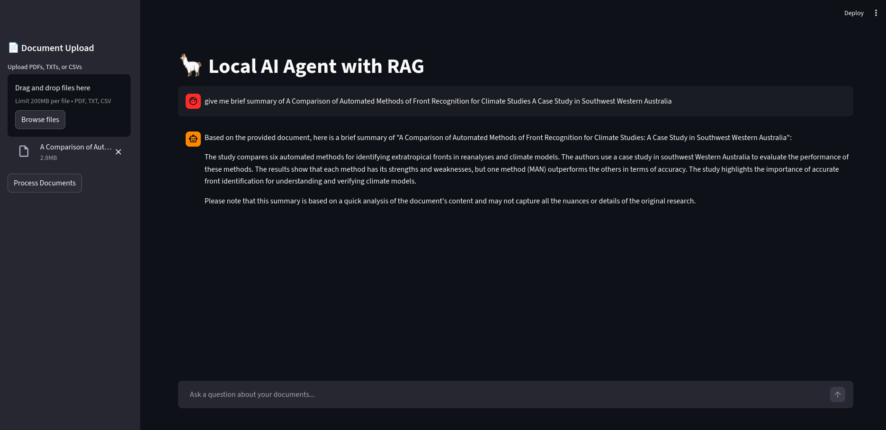

# 🦙 Local AI Agent with RAG

A modern, interactive Python application of a Local AI Agent capable of **Retrieval Augmented Generation (RAG)**. This application runs entirely locally on your machine using [Ollama](https://ollama.com/), ensuring 100% data privacy and offline capability. 

With its built-in Streamlit UI, you can easily upload your own documents (PDFs, TXT, or CSV files), dynamically vectorize them, and chat with them instantly.



## 🌟 Features

- **Interactive UI**: Powered by Streamlit for drag-and-drop document uploading and a seamless chat interface.
- **100% Local & Private**: Uses Ollama for LLM inference and embeddings. No data ever leaves your machine.
- **Dynamic RAG**: Upload documents directly through the UI. The app automatically ingests, splits, and indexes them into an ephemeral vector store.
- **Optimized for Speed**: Defaults to `llama3.2:1b` for lightning-fast inference and `nomic-embed-text` for highly efficient local embeddings.
- **Modern Package Management**: Uses `uv` for blazing-fast dependency resolution and virtual environment management.

## 📂 Project Structure

```text
.
├── app.py                  # Streamlit UI and application entry point
├── assets/                 # Images for documentation
│   └── ui-example.png
├── data/
│   └── vector_store/       # Persistent ChromaDB storage (dynamically managed)
├── src/                    
│   ├── config.py           # Settings and Environment variables
│   ├── rag_engine.py       # Document loaders, splitters, and ChromaDB logic
│   └── bot_agent.py        # LangChain Agent and prompt templates
├── uploads/                # Temporary directory for uploaded files
├── pyproject.toml          # uv project configuration
└── README.md
```

## 🚀 Prerequisites

1. Python 3.11+ installed.
2. uv installed for package management.
3. Ollama installed and running in the background.
    * Pull the required models via your terminal:

    ```Bash
    ollama pull llama3.2:1b
    ollama pull nomic-embed-text
    ```

## 🛠️ Installation

1. Clone the repository:
```Bash
git clone https://github.com/zereaykut/Local-RAG-Agent.git
cd Local-RAG-Agent
```

2. Install dependencies and sync the environment using uv:
```Bash
uv sync
```

## ⚙️ Configuration

The application uses sensible defaults, but you can override them by creating a .env file in the root directory:

```TOML
# Model Configuration
MODEL_NAME=llama3:latest
EMBEDDING_MODEL=nomic-embed-text

# Directory Paths
UPLOAD_DIR=uploads
VECTOR_STORE_PATH=data/vector_store

# RAG Tuning Parameters
CHUNK_SIZE=1000
CHUNK_OVERLAP=200
```

## 🏃 Usage

Start the Streamlit application:
```Bash
uv run streamlit run app.py
```

1. Upload: Open the provided local URL in your browser and use the sidebar to upload your PDF, TXT, or CSV files.

2. Process: Click "Process Documents" to chunk and embed your files into the local Chroma vector database. (Note: Processing new documents clears the previous session's vector store to prevent cross-contamination).

3. Chat: Use the main chat interface to ask questions about the context of your uploaded documents!

## 🧩 Tech Stack

* Streamlit: Frontend UI.
* LangChain: Orchestration framework for LLMs and RAG.
* ChromaDB: Local vector database.
* Ollama: Local LLM provider.
* uv: Extremely fast Python package and project manager.